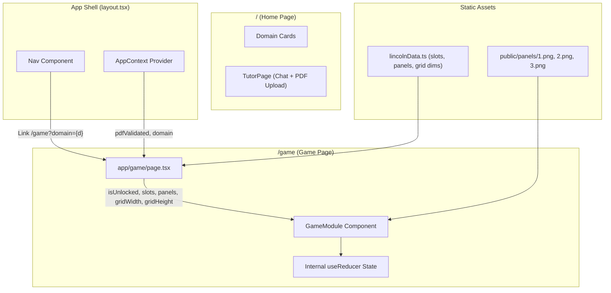
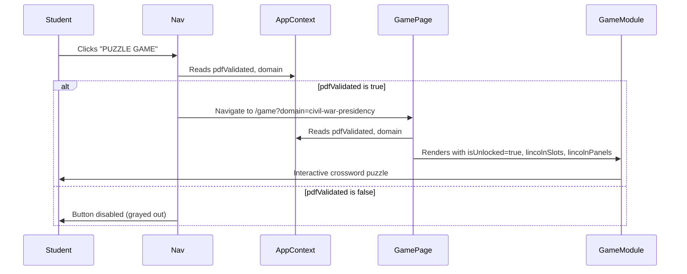

# Design Document: Game Module Integration

## Overview

This design describes how to integrate Aadhi's crossword puzzle Game Module into the Study Sanctum Next.js 14 application. The Game Module is a self-contained React component set that renders an interactive crossword puzzle with comic panel badges that unlock as words are solved. Integration involves copying source files, adding a dedicated `/game` route, wiring navigation, installing dependencies, loading the Bangers font, and connecting the module to the app's existing `AppContext` for `pdfValidated` gating.

The Game Module is already fully built with its own internal state management (useReducer), CSS Modules for style isolation, and a `ClueSet` validation layer. The integration work is primarily about wiring — not modifying the module's internals.

### Key Design Decisions

1. **Dedicated route vs. inline section**: The game gets its own `/game` page rather than being embedded in the main scrolling page. This keeps the tutor page focused and gives the game a full-screen experience. The `domain` query parameter maintains context across navigation.

2. **Props-based data flow**: The Game Page reads `pdfValidated` from `AppContext` and passes it as `isUnlocked` to `GameModule`. Lincoln puzzle data is imported statically. No new context providers are needed.

3. **CSS isolation preserved**: The Game Module uses CSS Modules exclusively. The only global addition is the Bangers Google Font loaded via `next/font/google` in `layout.tsx`.

4. **Nav uses Next.js Link**: The "PUZZLE GAME" button switches from an external URL (`NEXT_PUBLIC_GAME_APP_URL`) to an internal Next.js `Link` pointing to `/game?domain={domain}`.

## Architecture



### File Copy Layout

```
kiroHacks-Aadhi/components/GameModule/*  →  components/GameModule/*
kiroHacks-Aadhi/preview/1.png            →  public/panels/1.png
kiroHacks-Aadhi/preview/2.png            →  public/panels/2.png
kiroHacks-Aadhi/preview/3.png            →  public/panels/3.png
```

### Navigation Flow



## Components and Interfaces

### New Components

#### `app/game/page.tsx` (Game Page)

Client component (`'use client'`) that serves as the route handler for `/game`.

```typescript
// Responsibilities:
// - Read domain from URL search params
// - Read pdfValidated from AppContext
// - Import and render GameModule with Lincoln data
// - Derive lessonTitle from domain

interface GamePageProps {
  // Next.js App Router provides searchParams via useSearchParams()
}
```

### Modified Components

#### `components/Nav.tsx`

Changes:
- Replace `<a href={NEXT_PUBLIC_GAME_APP_URL}>` with `<Link href="/game?domain={domain}">`
- Remove dependency on `NEXT_PUBLIC_GAME_APP_URL` environment variable
- Keep disabled state when `pdfValidated` is false

#### `app/layout.tsx`

Changes:
- Import `Bangers` from `next/font/google`
- Add `--font-bangers` CSS variable to the `<body>` className

### Copied Components (Unchanged)

All files from `kiroHacks-Aadhi/components/GameModule/` are copied as-is:

| File | Purpose |
|------|---------|
| `GameModule.tsx` | Main component — crossword grid, panels, letter bank, ink bar, locked overlay, legacy cover modal |
| `GameModule.module.css` | Scoped CSS — pixel-art game theme |
| `GameContext.tsx` | React context + provider for game state (useReducer-based) |
| `reducer.ts` | Pure reducer function for game actions |
| `initState.ts` | Derives initial GameState from a ClueSet |
| `computeTier.ts` | Pure function computing panel tier level (0–3) |
| `validation.ts` | ClueSet validation — returns typed ClueSet or ValidationError |
| `validation.test.ts` | Property-based tests for validation (fast-check) |
| `types.ts` | Shared TypeScript interfaces |
| `lincolnData.ts` | Default Lincoln puzzle data (slots, panels, grid dimensions) |
| `lincolnClueSet.ts` | Alternative ClueSet format for Lincoln data |
| `index.ts` | Barrel exports |
| `CluePanel.tsx/module.css` | Clue list sub-component |
| `ComicPanel.tsx/module.css` | Comic panel badge sub-component |
| `ComicStrip.tsx/module.css` | Comic strip layout sub-component |
| `CrosswordArea.tsx/module.css` | Crossword area wrapper |
| `CrosswordGrid.tsx/module.css` | Grid rendering sub-component |
| `GridCell.tsx/module.css` | Individual cell sub-component |
| `InkLevelBar.tsx/module.css` | Ink progress bar sub-component |
| `LegacyCoverModal.tsx/module.css` | Legacy cover modal sub-component |
| `LetterBank.tsx/module.css` | QWERTY letter bank sub-component |
| `LetterTile.tsx/module.css` | Individual letter tile sub-component |
| `SectionHeader.tsx/module.css` | Section header sub-component |

### Props Contract

The Game Page passes these props to `GameModule`:

```typescript
<GameModule
  lessonTitle="Lincoln's Legacy Quest"       // derived from domain
  pdfFilename="lincoln-biography.pdf"        // descriptive label
  isUnlocked={pdfValidated}                  // from AppContext
  slots={lincolnSlots}                       // from lincolnData.ts
  panels={lincolnPanels}                     // from lincolnData.ts
  gridWidth={GRID_WIDTH}                     // 13 (from lincolnData.ts)
  gridHeight={GRID_HEIGHT}                   // 13 (from lincolnData.ts)
  studentName="Student"                      // default
  onWordSolved={(slotId) => console.log('Solved:', slotId)}
/>
```

## Data Models

### Existing Models (No Changes)

**AppContext State** (`context/AppContext.tsx`):
```typescript
interface AppState {
  sessionId: string | null;
  domain: Domain | null;        // e.g. 'civil-war-presidency'
  tutorId: TutorId | null;
  pdfValidated: boolean;        // gates game access
  setSession: (domain: Domain, tutorId: TutorId) => void;
  setPdfValidated: (val: boolean) => void;
}
```

### Copied Models (From GameModule)

**SlotConfig** (puzzle word definition):
```typescript
interface SlotConfig {
  id: string;          // e.g. 'lincoln-across'
  ans: string;         // uppercase answer, e.g. 'LINCOLN'
  clue: string;        // clue text
  dir: 'a' | 'd';     // across or down
  row: number;         // 0-indexed start row
  col: number;         // 0-indexed start column
  pid: string;         // panel ID this slot belongs to
}
```

**PanelConfig** (comic panel badge):
```typescript
interface PanelConfig {
  id: string;          // e.g. 'p1'
  label: string;       // e.g. 'PANEL 1 — EARLY LIFE'
  imageSrc: string;    // e.g. '/panels/1.png'
  badgeText: string;   // e.g. '🏅 EARLY LIFE!'
  unlockPct: number;   // ink % threshold to unlock (33, 66, 100)
}
```

**GameState** (internal reducer state — not exposed to Game Page):
```typescript
interface GameState {
  cells: Record<string, CellState>;
  slotStates: Record<string, SlotState>;
  ink: number;                    // 0–100
  selSlot: string | null;
  cursor: string | null;
  selLetter: string | null;
  unlockedPanels: Set<string>;
  published: boolean;
}
```

### Domain-to-Title Mapping

The Game Page derives `lessonTitle` from the domain:

```typescript
const DOMAIN_TITLES: Record<string, string> = {
  'civil-war-presidency': "Lincoln's Legacy Quest",
  'theoretical-physics': "Einstein's Discovery Quest",
  'classical-music': "Mozart's Composition Quest",
  'elizabethan-literature': "Shakespeare's Word Quest",
};
```

### New Dependencies

| Package | Version | Purpose |
|---------|---------|---------|
| `@dnd-kit/core` | latest | Drag-and-drop letter placement |
| `html-to-image` | latest | Legacy Cover PNG export |


## Correctness Properties

*A property is a characteristic or behavior that should hold true across all valid executions of a system — essentially, a formal statement about what the system should do. Properties serve as the bridge between human-readable specifications and machine-verifiable correctness guarantees.*

### Property 1: Domain-to-title mapping always produces a valid title

*For any* valid `Domain` string from the `TUTORS` configuration, the domain-to-title mapping function SHALL return a non-empty string suitable for use as `lessonTitle`.

**Validates: Requirements 4.6**

### Property 2: Nav puzzle link href matches domain

*For any* valid domain string, when `pdfValidated` is `true`, the Nav component's "PUZZLE GAME" link SHALL have an `href` equal to `/game?domain={domain}`.

**Validates: Requirements 5.1**

### Property 3: onWordSolved fires when a word slot is fully solved

*For any* word slot in the puzzle, when all of its cells are filled with the correct letters, the `onWordSolved` callback SHALL be invoked with that slot's ID.

**Validates: Requirements 7.1**

### Property 4: Panel unlocks when ink level meets threshold

*For any* sequence of word solves, when the resulting ink percentage (computed as `solvedSlots / totalSlots * 100`) meets or exceeds a panel's `unlockPct`, that panel SHALL be in an unlocked visual state.

**Validates: Requirements 7.2**

### Property 5: Game reset produces initial state (idempotence)

*For any* game state with arbitrary cells filled, slots solved, and panels unlocked, dispatching the RESET action SHALL produce a state where all cells are empty, ink level is 0, no panels are unlocked, and `published` is false — equivalent to the initial state derived from the same ClueSet.

**Validates: Requirements 7.4**

## Error Handling

### Navigation Errors

| Scenario | Handling |
|----------|----------|
| `/game` accessed without `domain` query param | Game Page falls back to `domain` from AppContext. If both are null, show the game with default Lincoln data (domain-agnostic). |
| `/game` accessed with invalid domain | Use default Lincoln data and a generic lesson title. |
| `pdfValidated` is false when navigating to `/game` directly | GameModule renders with `isUnlocked=false`, showing the locked overlay. No redirect needed. |

### Component Errors

| Scenario | Handling |
|----------|----------|
| Panel image fails to load (`/panels/1.png` missing) | Next.js `Image` component shows broken image. No crash — CSS handles gracefully with the panel's label still visible. |
| `lincolnData.ts` exports invalid data | The GameModule's internal validation (if using the `validateClueSet` path) returns `ValidationError`. The component should display an error state rather than crash. |
| `@dnd-kit/core` or `html-to-image` not installed | Build fails at import resolution. Caught at build time, not runtime. |

### State Errors

| Scenario | Handling |
|----------|----------|
| AppContext not available (GamePage rendered outside AppProvider) | `useAppContext()` throws "must be used within AppProvider". This cannot happen in practice since `layout.tsx` wraps all pages in `AppProvider`. |
| Session storage unavailable | AppContext gracefully handles this — `useEffect` catches parse errors. Game still works, just without session persistence. |

## Testing Strategy

### Property-Based Tests (fast-check)

The Game Module already includes property-based tests using `fast-check` (see `validation.test.ts`). The integration adds properties for the wiring layer.

**Library**: `fast-check` (already used in the GameModule's validation tests)
**Minimum iterations**: 100 per property

| Property | Test Description | Tag |
|----------|-----------------|-----|
| Property 1 | Generate random valid Domain values, verify domain-to-title mapping returns non-empty string | `Feature: game-module-integration, Property 1: Domain-to-title mapping always produces a valid title` |
| Property 2 | Generate random valid domain strings, render Nav with pdfValidated=true, verify link href | `Feature: game-module-integration, Property 2: Nav puzzle link href matches domain` |
| Property 3 | For each word slot, fill all cells with correct letters via reducer dispatch, verify onWordSolved callback fires | `Feature: game-module-integration, Property 3: onWordSolved fires when a word slot is fully solved` |
| Property 4 | Generate random solve sequences, compute ink level, verify panels unlock at correct thresholds | `Feature: game-module-integration, Property 4: Panel unlocks when ink level meets threshold` |
| Property 5 | Generate random game states (random letters placed), dispatch RESET, verify state matches initial state | `Feature: game-module-integration, Property 5: Game reset produces initial state` |

### Unit Tests (Example-Based)

| Test | Validates |
|------|-----------|
| Game Page renders GameModule with Lincoln data props | Req 4.1, 4.4 |
| Game Page reads domain from URL search params | Req 4.2 |
| Game Page reads pdfValidated from AppContext | Req 4.3, 4.5 |
| Game Page passes pdfFilename prop | Req 4.7 |
| Nav renders disabled button when pdfValidated=false | Req 5.2 |
| GameModule shows locked overlay when isUnlocked=false | Req 8.1 |
| GameModule hides locked overlay when isUnlocked=true | Req 8.2 |
| Legacy Cover modal appears when ink reaches 100% | Req 7.3 |
| pdfValidated change updates isUnlocked reactively | Req 8.3 |

### Smoke Tests

| Test | Validates |
|------|-----------|
| All GameModule files exist in components/GameModule/ | Req 1.1, 1.2 |
| index.ts exports GameModule and Lincoln data | Req 1.3 |
| Panel images exist at public/panels/ | Req 2.1 |
| package.json lists @dnd-kit/core and html-to-image | Req 3.1 |
| app/game/page.tsx has 'use client' directive | Req 4.8 |
| Nav.tsx does not reference NEXT_PUBLIC_GAME_APP_URL | Req 5.3 |
| All GameModule CSS files use .module.css extension | Req 6.1 |
| layout.tsx loads Bangers font | Req 6.4 |

### Integration Tests

| Test | Validates |
|------|-----------|
| Static file serving returns 200 for /panels/1.png | Req 2.2 |
| npm install completes without errors | Req 3.2 |
