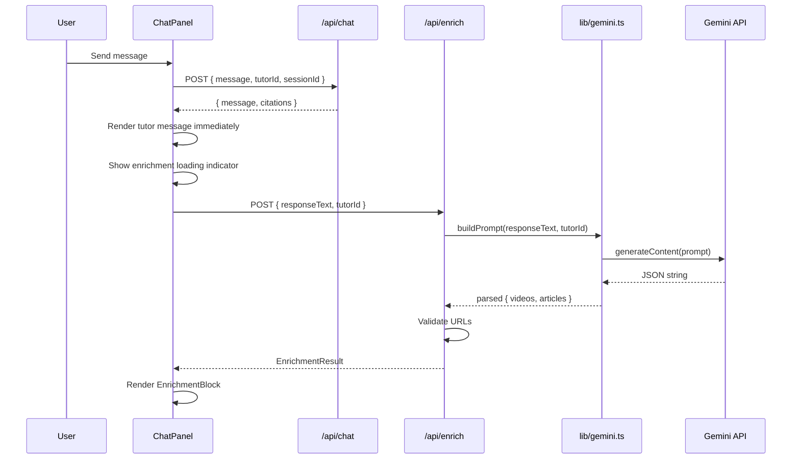

# Design Document: Gemini Content Enrichment

## Overview

This feature adds a Gemini-powered content enrichment layer to the Study Sanctum tutor chat. After each tutor response from the existing DeepSeek/Bedrock RAG pipeline, the frontend fires an asynchronous request to a new `/api/enrich` endpoint. That endpoint calls the Gemini `gemini-1.5-flash` model via the `@google/generative-ai` SDK, asking it to suggest up to 3 YouTube videos and 3 blog articles related to the tutor's response and domain. The results are rendered in a new `EnrichmentBlock` component below the tutor message bubble.

The enrichment is fully additive — the existing chat route, TTS pipeline, and FactsPanel are untouched. If the Gemini call fails, times out (10 s), or the API key is missing, the UI silently degrades to showing no enrichment content.

### Key Design Decisions

1. **Separate API route (`/api/enrich`)** rather than bundling enrichment into `/api/chat` — keeps the chat response latency unchanged and allows independent failure/retry.
2. **Client-side async fire-and-forget** — ChatPanel renders the tutor message immediately, then kicks off the enrichment call. A subtle loading skeleton shows while waiting.
3. **Server-side URL validation** — the `/api/enrich` route validates YouTube and article URLs before returning them to the client, filtering out malformed or non-HTTPS links.
4. **Graceful JSON fallback** — if Gemini returns unparseable output, the API returns `{ videos: [], articles: [] }` instead of an error, so the UI never breaks.

## Architecture



### Component Diagram

```mermaid
graph TD
    subgraph Frontend
        TP[TutorPage.tsx]
        CP[ChatPanel.tsx]
        EB[EnrichmentBlock.tsx]
    end

    subgraph API Routes
        CR[/api/chat - existing]
        ER[/api/enrich - new]
    end

    subgraph Server Libs
        RAG[lib/rag.ts - existing]
        GC[lib/gemini.ts - new]
        TU[lib/tutors.ts - existing]
    end

    subgraph External
        BK[Bedrock / DeepSeek]
        GM[Gemini API]
    end

    TP --> CP
    CP --> EB
    CP --> CR
    CP --> ER
    CR --> RAG
    RAG --> BK
    ER --> GC
    GC --> GM
    ER --> TU
    GC --> TU
```

## Components and Interfaces

### 1. `lib/gemini.ts` — Gemini Client Wrapper

A server-side module that initializes the `@google/generative-ai` SDK and exposes a single function to fetch enrichment content.

```typescript
import { GoogleGenerativeAI } from '@google/generative-ai';
import { TutorId, TUTORS } from './tutors';

export interface EnrichmentItem {
  url: string;
  title: string;
}

export interface EnrichmentResult {
  videos: EnrichmentItem[];
  articles: EnrichmentItem[];
}

/**
 * Calls Gemini gemini-1.5-flash with a domain-scoped prompt
 * and returns parsed enrichment content.
 */
export async function fetchEnrichment(
  responseText: string,
  tutorId: TutorId
): Promise<EnrichmentResult>;
```

Internally:
- Reads `GEMINI_API_KEY` from `process.env`.
- Constructs a prompt using the tutor's `name`, `domain`, and `domainTitle` from `TUTORS` config, plus the `responseText`.
- Instructs Gemini to return raw JSON `{ "videos": [...], "articles": [...] }`.
- Parses the response; on parse failure returns `{ videos: [], articles: [] }`.

### 2. `app/api/enrich/route.ts` — Enrichment API Route

```typescript
// POST /api/enrich
// Request:  { responseText: string, tutorId: TutorId }
// Response: EnrichmentResult | { error: string }

export async function POST(req: Request): Promise<Response>;
```

Responsibilities:
- Validates request body (`responseText` and `tutorId` required → 400).
- Checks `GEMINI_API_KEY` exists → 500 if missing.
- Calls `fetchEnrichment()`.
- Validates returned URLs:
  - Videos: must match `https://www.youtube.com/watch?v=` or `https://youtu.be/`.
  - Articles: must start with `https://`.
- Returns filtered `EnrichmentResult`.
- On Gemini call failure → 500.

### 3. `components/EnrichmentBlock.tsx` — UI Component

```typescript
interface EnrichmentBlockProps {
  videos: EnrichmentItem[];
  articles: EnrichmentItem[];
}

export default function EnrichmentBlock({ videos, articles }: EnrichmentBlockProps): JSX.Element;
```

Renders:
- A section of embedded YouTube iframes (converted to `/embed/{videoId}` format), each with a title label, at 100% width and 16:9 aspect ratio.
- A list of clickable article links (`target="_blank"`, `rel="noopener noreferrer"`), styled to match the retro theme.
- Nothing if both arrays are empty.

### 4. `components/ChatPanel.tsx` — Modified

Changes to the existing ChatPanel:
- After receiving a tutor response, fire an async `fetch('/api/enrich', ...)` with a 10-second `AbortController` timeout.
- Store enrichment results per message (keyed by message `id`).
- Render `<EnrichmentBlock>` below each tutor message bubble that has enrichment data.
- Show a small loading skeleton while the enrichment call is in flight.
- If `GEMINI_API_KEY` is not set (detected via a missing/empty env var passed as a Next.js public env or by the enrich endpoint returning 500), skip the call entirely.

The `Message` interface gains an optional field:

```typescript
interface Message {
  id: string;
  role: 'user' | 'tutor';
  text: string;
  citations?: Array<{ id: number; source: string; year: string; url: string }>;
  enrichment?: EnrichmentResult | null; // null = loading, undefined = not requested
}
```

## Data Models

### EnrichmentItem

| Field   | Type     | Description                          |
|---------|----------|--------------------------------------|
| `url`   | `string` | Full HTTPS URL to the resource       |
| `title` | `string` | Human-readable title for display     |

### EnrichmentResult

| Field      | Type                | Constraints          |
|------------|---------------------|----------------------|
| `videos`   | `EnrichmentItem[]`  | 0–3 items, validated |
| `articles` | `EnrichmentItem[]`  | 0–3 items, validated |

### Gemini Prompt Template

```
You are a helpful educational assistant. Given the following tutor response about
{domainTitle} by {tutorName}, suggest up to 3 real YouTube videos and up to 3 real
blog posts or articles that a student could use to learn more about the specific
topic discussed.

Tutor response:
"""
{responseText}
"""

Return ONLY a raw JSON object (no markdown, no code fences) with this exact structure:
{
  "videos": [{ "url": "https://www.youtube.com/watch?v=...", "title": "..." }],
  "articles": [{ "url": "https://...", "title": "..." }]
}

Rules:
- Only suggest real, existing URLs. Do not fabricate links.
- All content must be educational and age-appropriate for students.
- YouTube URLs must use the https://www.youtube.com/watch?v= format.
- Article URLs must use HTTPS.
- If you cannot find enough real resources, return fewer items. Do not pad with placeholders.
```

### URL Validation Rules

| Type    | Pattern                                                                 |
|---------|-------------------------------------------------------------------------|
| Video   | Starts with `https://www.youtube.com/watch?v=` OR `https://youtu.be/`  |
| Article | Starts with `https://`                                                  |

### YouTube Embed URL Conversion

The `EnrichmentBlock` extracts the video ID and constructs the embed URL:
- `https://www.youtube.com/watch?v=VIDEO_ID` → `https://www.youtube.com/embed/VIDEO_ID`
- `https://youtu.be/VIDEO_ID` → `https://www.youtube.com/embed/VIDEO_ID`


## Correctness Properties

*A property is a characteristic or behavior that should hold true across all valid executions of a system — essentially, a formal statement about what the system should do. Properties serve as the bridge between human-readable specifications and machine-verifiable correctness guarantees.*

### Property 1: Prompt includes responseText, tutor domain, and tutor name

*For any* valid `responseText` string and *for any* valid `tutorId`, the prompt constructed by the Gemini client SHALL contain the `responseText`, the tutor's `domain`, and the tutor's `name` from the TUTORS configuration.

**Validates: Requirements 2.6, 9.2, 9.3**

### Property 2: URL filtering preserves only valid URLs

*For any* Gemini response containing an array of video objects and an array of article objects with arbitrary URL strings, the enrichment API SHALL return only those videos whose `url` starts with `https://www.youtube.com/watch?v=` or `https://youtu.be/`, and only those articles whose `url` starts with `https://`.

**Validates: Requirements 4.2, 4.3**

### Property 3: Output schema invariant

*For any* valid Gemini JSON response containing between 0 and N video objects and between 0 and M article objects (all with valid URLs), the enrichment API SHALL return an `EnrichmentResult` with at most 3 videos and at most 3 articles, where each item has a `url` (string) and `title` (string) field, and no placeholder or padded entries are added.

**Validates: Requirements 2.3, 4.1, 4.4**

### Property 4: Unparseable Gemini response yields empty result

*For any* string that is not valid JSON, when the Gemini model returns that string as its response, the enrichment API SHALL return `{ videos: [], articles: [] }` rather than an error.

**Validates: Requirements 4.6**

### Property 5: YouTube watch URL to embed URL conversion

*For any* valid YouTube video ID string, the EnrichmentBlock component SHALL convert `https://www.youtube.com/watch?v={videoId}` to `https://www.youtube.com/embed/{videoId}` and `https://youtu.be/{videoId}` to `https://www.youtube.com/embed/{videoId}` for iframe `src` attributes.

**Validates: Requirements 6.2**

### Property 6: Rendered enrichment item count matches data

*For any* `EnrichmentResult` containing between 0 and 3 video objects and between 0 and 3 article objects, the EnrichmentBlock component SHALL render exactly as many iframe elements as there are videos and exactly as many link elements as there are articles.

**Validates: Requirements 6.1, 7.1**

### Property 7: All enrichment titles appear in rendered output

*For any* `EnrichmentResult` where each video and article has a non-empty `title`, the EnrichmentBlock component's rendered output SHALL contain every video title as a label and every article title as link text.

**Validates: Requirements 6.4, 7.3**

## Error Handling

| Scenario | Layer | Behavior |
|---|---|---|
| `GEMINI_API_KEY` missing/empty | `/api/enrich` | Return HTTP 500 with `{ error: "GEMINI_API_KEY is not configured" }` |
| Request body missing `responseText` or `tutorId` | `/api/enrich` | Return HTTP 400 with `{ error: "Missing required fields: responseText, tutorId" }` |
| Gemini SDK throws (network error, rate limit, etc.) | `/api/enrich` | Catch error, return HTTP 500 with `{ error: "Enrichment failed" }` |
| Gemini returns non-JSON text | `lib/gemini.ts` | Catch JSON parse error, return `{ videos: [], articles: [] }` |
| Gemini returns JSON missing `videos` or `articles` keys | `lib/gemini.ts` | Default missing keys to empty arrays |
| Enrichment fetch fails or returns non-200 | `ChatPanel.tsx` | Silently set enrichment to `undefined`, hide loading indicator, show no enrichment block |
| Enrichment fetch exceeds 10 seconds | `ChatPanel.tsx` | `AbortController` aborts the request; treat as failure (silent degradation) |
| `GEMINI_API_KEY` not configured (client-side detection) | `ChatPanel.tsx` | Skip the enrichment fetch entirely — no loading indicator, no enrichment block |

All error paths are designed so the student never sees an error message related to enrichment. The chat experience degrades gracefully to the pre-enrichment baseline.

## Testing Strategy

### Unit Tests

Unit tests cover specific examples, edge cases, and error conditions:

**`lib/gemini.ts`:**
- Prompt includes "theoretical physics" and "Albert Einstein" for `einstein` tutorId (Req 3.1)
- Prompt includes "American Civil War" and "Abraham Lincoln" for `lincoln` tutorId (Req 3.2)
- Prompt includes "classical music" and "Wolfgang Amadeus Mozart" for `mozart` tutorId (Req 3.3)
- Prompt includes "English literature" and "William Shakespeare" for `shakespeare` tutorId (Req 3.4)
- Prompt includes educational/age-appropriate instruction (Req 3.5)
- Prompt instructs Gemini to return raw JSON (Req 9.1)
- Prompt instructs Gemini to return real URLs (Req 9.4)
- Client uses `gemini-1.5-flash` model (Req 9.5)

**`/api/enrich` route:**
- Returns 400 when `responseText` is missing (Req 2.4)
- Returns 400 when `tutorId` is missing (Req 2.4)
- Returns 500 when `GEMINI_API_KEY` is not set (Req 1.3)
- Returns 500 when Gemini call throws (Req 2.5)

**`EnrichmentBlock` component:**
- Renders nothing when both arrays are empty
- Iframes have 100% width and 16:9 aspect ratio (Req 6.3)
- Article links have `target="_blank"` and `rel="noopener noreferrer"` (Req 7.2)
- Renders below tutor message in ChatPanel (Req 6.5)
- Styled consistently with retro theme (Req 7.4)

**`ChatPanel` integration:**
- Tutor message renders before enrichment data arrives (Req 5.1)
- Enrichment fetch is called after tutor response (Req 5.2)
- Loading indicator shows during enrichment fetch (Req 5.3)
- Loading indicator hides on enrichment failure (Req 5.4)
- AbortController timeout is set to 10 seconds (Req 5.5)
- Enrichment call is skipped when API key is not configured (Req 8.4)
- Existing chat, TTS, and citations still work (Req 8.1, 8.2)

### Property-Based Tests

Property-based tests use `fast-check` (to be added as a dev dependency) with a minimum of 100 iterations per property. Each test references its design document property.

| Test | Property | Tag |
|---|---|---|
| Prompt construction | Property 1 | `Feature: gemini-content-enrichment, Property 1: Prompt includes responseText, tutor domain, and tutor name` |
| URL filtering | Property 2 | `Feature: gemini-content-enrichment, Property 2: URL filtering preserves only valid URLs` |
| Output schema invariant | Property 3 | `Feature: gemini-content-enrichment, Property 3: Output schema invariant` |
| Unparseable JSON fallback | Property 4 | `Feature: gemini-content-enrichment, Property 4: Unparseable Gemini response yields empty result` |
| YouTube embed conversion | Property 5 | `Feature: gemini-content-enrichment, Property 5: YouTube watch URL to embed URL conversion` |
| Rendered item count | Property 6 | `Feature: gemini-content-enrichment, Property 6: Rendered enrichment item count matches data` |
| Titles in output | Property 7 | `Feature: gemini-content-enrichment, Property 7: All enrichment titles appear in rendered output` |

### Testing Library

- **Property-based testing:** `fast-check` — the standard PBT library for TypeScript/JavaScript
- **Unit/component testing:** `vitest` + `@testing-library/react` for component tests
- **Configuration:** Each property test runs a minimum of 100 iterations (`fc.assert(property, { numRuns: 100 })`)
