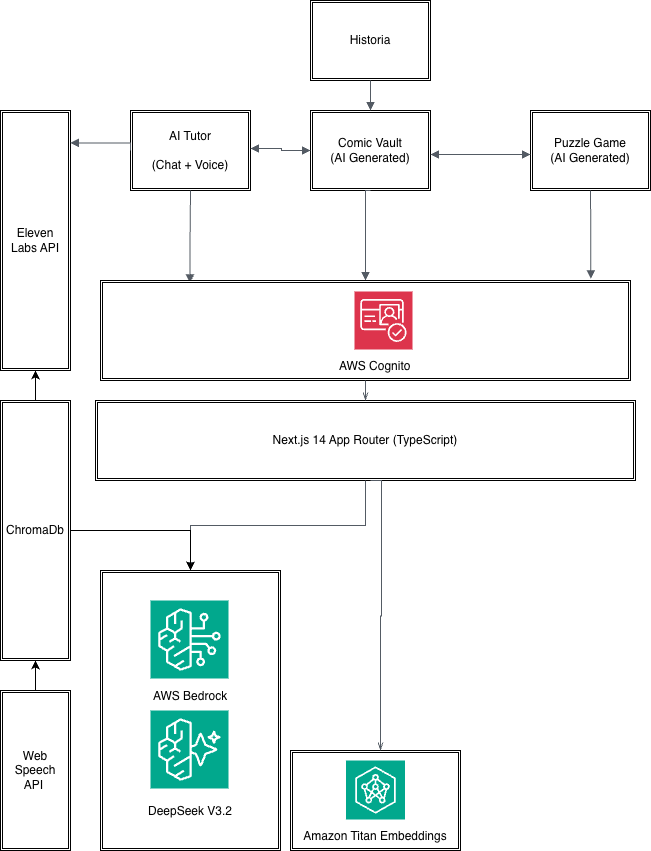

# 🏛️ Historia — AI-Powered Historical Tutoring Platform

> **Kiro Spark Challenge 2026 | ASU × AWS Hackathon**
> **Frame: Education — The "Agency" Guardrail**
> **Signals: Build 🔧 | Collaboration 🤝 | Impact 🌍**

[](YOUR_YOUTUBE_VIDEO_URL_HERE)
[](LICENSE)

---

## 📌 Problem Statement

Students in grades 6–8 learn about historical figures and events through static textbooks. Reading about Abraham Lincoln's presidency or Einstein's theories from a printed page is **passive and disengaging**. Students memorize facts for tests but don't develop genuine curiosity or deep understanding. The learning experience lacks interactivity, personalization, and the kind of immersive engagement that today's digital-native students expect.

**Historia solves this** by transforming textbook learning into an interactive, multi-modal experience where AI serves as *scaffolding* not the solution. Students actively engage with historical figures through conversation, voice interaction, visual comics, and puzzle games. The AI empowers learners to explore topics they couldn't access before (like having a conversation with Einstein about relativity), without doing the learning *for* them.

---

## 🎯 What Historia Does

Historia is a full-stack AI tutoring platform where students:

1. **Choose a topic** — Theoretical Physics, American Civil War & Presidency, Classical Music Composition, or English Literature & Elizabethan Drama (more topics coming soon)
2. **Chat with an AI tutor** — A domain-expert AI tutor responds in-character using RAG over a curated knowledge base, with citations
3. **Talk using voice** — Press MIC to speak, the tutor responds with a unique AI-generated voice (ElevenLabs TTS)
4. **Upload a PDF chapter** — The AI validates if it matches the selected topic, unlocking bonus modules
5. **Explore a Comic Vault** — AI-generated comic pages that visualize the historical narrative
6. **Play a Crossword Puzzle Game** — AI-generated crossword with clues tied to the topic, with comic panel badges that unlock as words are solved
7. **Authenticate securely** — AWS Amplify + Cognito for user sign-up/sign-in with email verification

> 📌 Historia currently ships with 4 topics, each paired with a historical tutor persona. The platform is designed to be **extensible** — new topics and tutors can be added by simply dropping knowledge base files and configuring a new tutor entry. We plan to expand to more subjects like World Geography, Ancient Civilizations, Biology, and more.

---

## 🏗️ Architecture



### How It All Connects

- **Students** authenticate via **AWS Cognito**, then choose a topic
- The **AI Tutor** uses a RAG pipeline: queries are embedded via **Amazon Titan Embeddings**, matched against **ChromaDB**, and answered by **DeepSeek v3.2 on AWS Bedrock**
- **ElevenLabs API** gives each tutor a unique voice; **Web Speech API** handles voice input
- The **Comic Vault** and **Puzzle Game** content were **AI-generated using AWS Bedrock** during the initial build, then cached for consistent demo performance
- Everything runs through **Next.js 14 App Router** with TypeScript

### Content Generation Pipeline

The comic pages and crossword puzzle game are **not hardcoded** — they were generated using an agentic AI workflow:

1. **Comic Generation**: AWS Bedrock was used to generate narrative scripts for each historical figure, which were then rendered into comic panel images through an AI image generation pipeline
2. **Puzzle Generation**: AWS Bedrock generated domain-specific crossword clues, answers, and grid layouts based on each tutor's knowledge base content
3. **First-run generation, subsequent caching**: The AI agent generated all content during the initial build, and the outputs were cached for subsequent demo runs to ensure consistent, fast performance

---

## 🛠️ Tech Stack

| Layer | Technology | Purpose |
|-------|-----------|---------|
| Frontend | Next.js 14 (App Router), React 18, TypeScript | UI framework |
| Styling | Tailwind CSS, CSS Modules | Retro pixel-art theme |
| Auth | AWS Amplify v6 + Amazon Cognito | Sign-up/sign-in with email verification |
| LLM | DeepSeek v3.2 via AWS Bedrock | In-character tutor responses, facts generation |
| Embeddings | Amazon Titan Embed Text v2 via AWS Bedrock | Query embedding for RAG |
| Vector DB | ChromaDB (Python FastAPI sidecar) | Knowledge base storage and retrieval |
| TTS | ElevenLabs (eleven_turbo_v2_5) | Unique voice per tutor character |
| Voice Input | Web Speech API (SpeechRecognition) | Browser-native speech-to-text |
| PDF Parsing | unpdf | Extract text from uploaded PDFs |
| Game Module | React + CSS Modules + @dnd-kit | Interactive crossword puzzle |
| Comic Viewer | React + Next.js Image | Paginated comic reader with lightbox |

---

## 🚀 Getting Started

### Prerequisites
- Node.js 20+
- Python 3.11+
- AWS account with Bedrock access (us-west-2)
- ElevenLabs API key
- AWS Cognito User Pool

### Setup

```bash
# Clone the repo
git clone https://github.com/YOUR_USERNAME/YOUR_REPO.git
cd YOUR_REPO

# Install dependencies
npm install

# Set up environment variables
cp .env.local.example .env.local
# Fill in your API keys (see Environment Variables section below)

# Build the knowledge base (one-time)
cd scripts && pip install -r requirements.txt && python build_kb.py && cd ..

# Start the Chroma sidecar
cd sidecar && pip install -r requirements.txt && uvicorn main:app --port 8001 &

# Start the app
npm run dev
```

### Environment Variables

Create `.env.local` with:
```bash
# AWS
AWS_ACCESS_KEY_ID=your_key
AWS_SECRET_ACCESS_KEY=your_secret
AWS_REGION=us-west-2

# Bedrock Models
BEDROCK_PRIMARY_MODEL=deepseek.v3.2
BEDROCK_FALLBACK_MODEL=deepseek.v3-v1:0
BEDROCK_EMBEDDING_MODEL=amazon.titan-embed-text-v2:0

# ElevenLabs TTS
ELEVENLABS_API_KEY=your_elevenlabs_key

# Chroma Sidecar
CHROMA_SIDECAR_URL=http://localhost:8001

# AWS Cognito
NEXT_PUBLIC_COGNITO_USER_POOL_ID=us-west-2_xxxxx
NEXT_PUBLIC_COGNITO_CLIENT_ID=your_client_id
```

---

## 📹 Demo Video

[](YOUR_YOUTUBE_VIDEO_URL_HERE)

---

## 🤝 Team & Collaboration

### Team Members

| Member | Role | Kiro Usage |
|--------|------|------------|
| **Vraj Chaudhari** | Strategist + Builder | Architected the full platform, built the AI tutor chat with RAG pipeline, voice I/O, authentication, and integrated all three modules. Used Kiro's spec-driven development for every feature — requirements → design → tasks → execution. Created agent hooks for linting and API review, steering docs for coding standards. |
| **Vaibhav** | Designer + Builder | Designed and built the Comic Vault page with AI-generated comic panels. Used AWS Bedrock's agentic workflow to generate narrative scripts and comic visuals for each historical figure. Focused on the visual storytelling experience and retro UI aesthetic. |
| **Aditya** | Builder + Designer | Built the crossword Puzzle Game module with AI-generated clues and grid layouts. Used AWS Bedrock to generate domain-specific crossword content from the knowledge base. Designed the game mechanics including ink level progression and comic panel badge unlocking. |

### How Kiro Enabled Collaboration

Kiro was the backbone of our integration workflow. Each team member built their module independently using Kiro's agentic AI features, and then Kiro helped us integrate everything seamlessly:

- **Vraj** used Kiro's **spec-driven development** to create formal requirements → design → task documents for each integration (game module, comic module, auth, voice improvements). This gave the team a clear contract for how modules would connect.
- **Vaibhav's** comic module and **Aditya's** game module were integrated into the main platform using Kiro specs that defined exact props, routes, and data contracts — no guesswork.
- Kiro's **agent hooks** automated linting on save and API route reviews, catching issues before they became bugs.
- Kiro's **steering docs** ensured consistent coding standards across all three contributors' code.

---

## 🔧 Kiro Features Used

### Spec-Driven Development
We created **4 full specs** with requirements, design, and implementation tasks:
- `docs-implementation-alignment` — Bugfix spec aligning documentation with actual implementation
- `game-module-integration` — Integrating the crossword puzzle game
- `session-auth-voice-improvements` — Auth, session management, voice, and UI improvements
- `gemini-content-enrichment` — Content enrichment pipeline

Each spec followed the full workflow: **Requirements → Design (with correctness properties) → Tasks → Execution**

### Agent Hooks
- **Lint on Save** — Auto-runs ESLint on TypeScript files when saved
- **API Route Review** — Reviews API route changes for validation, error handling, and security
- **Build Check After Task** — Runs Next.js build after each spec task completes

### Steering Docs
- **Coding Standards** (auto-included) — Model IDs, API patterns, env var conventions, testing approach
- **Project Context** (auto-included) — Architecture overview, key files, running instructions

### MCP Server
- **AWS Documentation Server** — Integrated for looking up Bedrock, Cognito, and other AWS service docs directly in the IDE

### Vibe Coding
Used extensively for rapid iteration on UI components, CSS styling, bug fixes, and quick feature additions that didn't warrant a full spec.

---

## 🌍 Impact Signal — Why This Matters

### The Problem
6th–8th grade students learn about historical figures through static textbooks. The experience is passive — read, memorize, test, forget. There's no engagement, no personalization, and no way to ask "what if?" questions to a historical figure.

### Our Solution
Historia uses AI as **scaffolding** — it doesn't do the learning for students, it empowers them to learn in ways they couldn't before:

- **Active engagement**: Students ask their own questions and get personalized, in-character responses with citations to real sources
- **Multi-modal learning**: Text chat, voice conversation, visual comics, and interactive puzzles address different learning styles
- **Domain validation**: PDF upload ensures students are studying relevant material before unlocking bonus content
- **Agency preserved**: The AI guides and responds, but the student drives the conversation and chooses what to explore

### Real-World Applicability
- Deployable in classrooms as a supplementary learning tool
- Extensible to any historical figure or subject domain
- Cost-effective: runs on AWS free tier for demo usage (~$0.22 per 30-minute session)
- No student data persisted beyond the browser session

---

## 📁 Project Structure

```
├── .kiro/                    # Kiro specs, hooks, steering, MCP config
│   ├── specs/                # 4 feature specs (requirements, design, tasks)
│   ├── hooks/                # Agent hooks (lint, API review, build check)
│   ├── steering/             # Coding standards, project context
│   └── settings/             # MCP server config
├── app/                      # Next.js App Router
│   ├── page.tsx              # Home page with domain cards
│   ├── layout.tsx            # Root layout (fonts, auth, providers)
│   ├── game/page.tsx         # Puzzle game route
│   ├── comic/page.tsx        # Comic vault route
│   └── api/                  # API routes (chat, tts, facts, validate-pdf, enrich, session)
├── components/               # React components
│   ├── ChatPanel.tsx         # Chat UI with voice controls
│   ├── TutorPage.tsx         # Tutor page layout
│   ├── AudioPlayer.tsx       # Web Audio API player
│   ├── AuthGate.tsx          # Amplify authentication gate
│   ├── GameModule/           # Crossword puzzle game (AI-generated)
│   ├── ComicViewer.tsx       # Comic page viewer
│   └── avatars/              # CSS-drawn character avatars
├── lib/                      # Server-side utilities
│   ├── rag.ts                # RAG pipeline (embed → retrieve → generate)
│   ├── tts.ts                # ElevenLabs TTS client
│   ├── bedrock.ts            # AWS Bedrock client
│   ├── chroma.ts             # ChromaDB sidecar client
│   ├── tutors.ts             # Tutor configuration
│   └── personas.ts           # Character system prompts
├── hooks/                    # Custom React hooks
│   └── useWakeWordListener.ts
├── context/                  # React Context
│   └── AppContext.tsx         # App state (domain, tutor, session)
├── sidecar/                  # Python FastAPI ChromaDB sidecar
├── scripts/                  # Knowledge base build scripts
├── data/                     # Knowledge base text files + ChromaDB
└── public/                   # Static assets (avatars, panels)
```

---

## 📜 License

This project is licensed under the MIT License — see the [LICENSE](LICENSE) file for details.

---

**Built with ❤️ using [Kiro](https://kiro.dev) at the Kiro Spark Challenge 2026, ASU × AWS**
